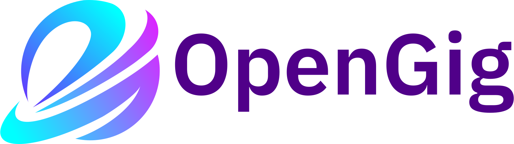

OpenGig Business Plan

---
 

# Executive Summary
## Introduction
OpenGig is a cooperative platform based in Waterloo, Ontario, Canada. Our goal is to create a fair labor marketplace that benefits workers, consumers, and employees equally. Most modern labor platforms are wasteful and predatory, causing workers and customers to suffer financially for shareholder gain. OpenGig aims to fix this by operating as a lean, at-cost cooperative that avoids the reckless spending and bloated overhead commonly found in traditional startups and labor platforms.

A cooperative structure fits our market better than the typical investor-led approach. Even the largest labor platforms struggle to be profitable under that model. By letting users, both workers and customers, directly invest in the coop (similar to a credit union), we remove the pressure of traditional investors demanding high returns.

Instead of manipulative pricing, surge fees, or other tricks, OpenGig will charge a fair usage fee per transaction based on actual expenses—not on how much users can pay.Running modern digital platforms efficiently is cheaper than most people realize. The true cost includes fair wages for employees, hardware, marketing, legal fees, domain costs, and maintenance. The true issue lies with predatory investors, executive sallaries and bonuses, missmanaged ventures, stock buy backs, and other wasteful startup gimics like ping pong table, craft beer on tap, slides, nerf gun battles, bean bag chairs, and excessive physical office space.

With our cooperative structure, employees are held accountable for their choices and management of the platform by the workers, customers, and each other.This ensures a responsible business model that is profitable and fair.

## Mission Statement
OpenGig will emancipate workers and customers from the unfair and illegal practices that other labor platforms perpetuate, by providing a transparent, equitable, and member driven alternative that prioritizes their wellbeing and freedom. We aim to be a platform supporting labour transactions, not a middeavil lord placing a chain accross a river and charging a toll to lower it.

## Problem Description
Today’s digital labor platforms often lack transparency, accountability, and efficiency. Major players are strattled with debt, appease demanding investors, have astronomical evaluations, overspend on growth, and still struggle to turn a profit. Workers and customers end up bearing the real costs of this mismanagement.
This provides an opportunity for a small, efficient, unburdened competitor to enter the space.

## Our Solution
OpenGig solves these problems by creating an efficient, profitable, and fair cooperative platform that removes the wasteful incentives typical of big unicorn startups. With the right design, a platform can be cost effective, ethically run, and still more profitable per employee and member than most funded companies.

## Business Model
OpenGig is a multi stakeholder cooperative with three member types: workers, customers, and employees. Employees manage and develop the platform, similar to a traditional startup team. Members can vote on two key actions:

• Recall Votes: to reverse decisions employees make if workers and customers believe those decisions go against OpenGig’s core values.

• Feature Votes: to request new features or improvements.

This voting system keeps employees accountable while allowing them to move quickly on decisions based on their expertise.

The OpenGig voting system serves as a corrective measure to balance the need for development speed and worker and customer interests. Employees are a trusted group, making informed decisions given their speciality and intrusted to make the correct decisions for the benifit of the cooperative.

## Value Proposition
The value proposition that OpenGig brings to the table is quite substantial and obvious, we do not overly charge our workers and customers. We provide clear metrics and open data so workers can make informed, independent business decisions rather than be forced into surge pricing or hidden fees. True market dynamics come from many individuals making decisions—not from a single platform dictating prices.

We run at cost, paying fair wages to employees and avoiding bloated executive salaries. Customers pay only for the actual cost of fulfilling their requests and running the platform. This lean approach offers employees fair, livable salaries, gives workers direct control over their compensation, and offers customers a better deal than predatory labor platforms.

## Market Opportunity

The gig economy is experiencing rapid growth, driven by an increasing shift away from traditional employment models towards more flexible, self determined short term contract based work.

There is a substantial opportunity to create a blue ocean in this market with a  cooperative model that does not have high cost structures and complex hidden pricing. OpenGig is well positioned to attract members from gig workers disillusioned by diminishing returns, to consumers seeking more ethical and cost effective platforms.

At the regional level, Waterloo, Ontario, offers a tech based community and a supportive regulatory environment, ideal for piloting and growing our platform. Using these local resources and scaling responsibly, OpenGig aims to build a sustainable, cooperative-based digital marketplaces.

## Financial Plan

OpenGig's financial strategy is quick profitability through partnerships and existing expertise and resources. As the founder, I, Torrin Z. Leonard, will personally fund the initial phase of development, ensuring sufficient resources are available for platform development, marketing, and operational expenses.

**Revenue Model:**
- We’ll charge a straightforward usage fee per transaction that covers operational costs without overburdening users.
- Early community engagement and signing up local contractors will help us reach profitability faster.

**Cost Structure:**
- To lower upfront investment costs, we will employ contract workers for critical functions such as legal (to establish the cooperative corporation), tax and accounting, marketing, and UI/UX design.
- Involved directly in the platform's development, I will utilize my extensive software development experience to build a functional Minimum Viable Product, significantly reducing the development and deployment costs.
- Platform hosting on Digital ocean for our database, and server. As well as minor expenses such as web domain aquisition.

**Investment Strategy and Growth Plan:**
- Our initial funding will be self provided, with future financial boosts potentially sourced from partnerships and grants, particularly from local, provincial, and federal government bodies and organizations advocating for cooperative business models and fair labour marketplace platforms.
- Establishing strong local ties is central to our plan, as it will help build a reliable membership base essential for the platform’s long term financial sustainability and success.
- OpenGig membership will initially be free, but we plan to implement a reasonable $5 membership share purchase that offically grants membership to the OpenGig coop, much like how credit unions operate.
- Members and the community will be encouraged to donate to the OpenGig cooperative to further development, we will provide financial information and transparrency to establish trust.

**Financial Projections:**
- OpenGig's financial projections are realistically conservative, focusing on achievable short-term targets for new members and revenue generation.
- We will continually analyze financial performance and adjust strategies to ensure ongoing fiscal health and alignment with market developments.

## Social Impact
We want to offer fair, transparent opportunities for workers and customers, starting in Waterloo, Ontario.

**Local Impact:**
Through community outreach and partnerships with local government and organizations, we're not just building a platform; we're building a community where workers and customers can interact on fair terms. Our platform will feature a social media like profile for workers and users to allow workers to maintain local customer relationships, unlike traditional labour platofrms.

**Expanding Across Canada:**
Once established locally, we’ll take the same model national. By growing our cooperative membership, we plan to become a go to solution for fair labor relations across Canada.

We’re not about overpromising; we’re about delivering real change. By continuously listening to the needs of our cooperative members and adjusting our strategies based on their input, we aim to create positive change within the gig economy.

## Vision for the Future
Initially, OpenGig will target basic gig and contract work like plumbing, web design, housekeeping, painting, and similar services. This doesn’t require overly complex technology.The development effort needed to create such a platform isn't complex.

The next phase of development, once a significant membership base and community awareness has been built, will be to tackle ride sharing. This will require the development of a mobile application for gps and mapping features. Mobile development will also make the whole service more convineient for users. After the ride sharing mobile phase, OpenGig will aim to tackle short term lodging and other aspects of the digital labour economy.

Ultimately, OpenGig will become a comprehensive labor platform for the gig economy.

## Executive Summary Conclusion
OpenGig exists to give workers, customers, and employees a fair deal. By staying lean and transparent, we’re flipping the script on labor platforms that sacrifice user well-being for shareholder gains. Starting in Waterloo, Ontario, we’ll grow into a community of members who get the real value they deserve.

Our plan is simple: prioritize trust, transparency, and sustainability. By listening to our cooperative, we’ll deliver real improvements rather than empty marketing. We believe OpenGig can redefine and fix the predatory gig economy by putting fairness and transparency first.

We're not just another startup; we're a movement for change. That’s OpenGig.

---

# Cooperative Governance Structure
OpenGig is a multi stakeholder cooperative with three types of memebers: workers, customers, and employees. All memebers have voting rights on cooperative votes for major decisions on running the platform and feature improvements.

## Employees
**Employees** are memebers of the cooperative that design and develop the platform, as well as  manage the **Core Team**. **Employees** are trusted to have the expertise to evaluate the technical and operational needs of the cooperative. This includes managing the development, marketing, legal, managearial, and hiring needs of the cooperative.

The governance system of employees is such that while employees are trusted to run the platform, any of their decisions can be reversed if a vote is called to reverse a decision. These can include anything from payment resturcturings, feature development, employee hirings, or rebranding efforts.

The goal is to allow employees to make quick, informed decisions, while also allowing for accountability if they abuse their power.

## Workers
**Workers** are the memebers of the cooperative that advertise, and execute labour for monetary compensation from **Customers**.

## Customers
**Customers** are the memebers of the cooperative that purchase labour or products from **workers**.

## Vote Proposals

OpenGig has an open submission voting system where all members are able to submit a vote proposal on our dedicated public forum (to be built). Members will be required to submit basic criteria for proposals, such as a clear description of the issue, proposed solutions, and the impact on different stakeholders. Each proposal will have a deadecated public comment section, allowing members of other stakeholder groups to have their voices heard.

## Vote Vetting
Members can express initial interest or disapproval by upvoting or downvoting proposals on the forum. Votes get approved and go forward to be member wide votes if they pass the **active member vote threshold**, a (to be determined) percentage of the active members of OpenGig.

# Market Analysis 

# Organization and Management

# Products or Services

# Marketing and Sales Strategy

# Operations Plan

# Financial Plan

# Appendices

# TODO: other points to mention
our commitment to open source and the rest of the principles outlined in the main readme:

OpenGig.org is an Open Source Service platform built for gig workers and customers. We stand for openness, the rights of customers, and for the empowerment of workers.

# Why work on OpenGig?
Our platform empowers gig workers by removing the greedy middlemen. OpenGig allows you to dictate your own terms by providing tools built for you.

- Set your own rates and earn a fair share.
- Use transparent, open-source pricing algorithms that suggest fair prices based on real data.
- Enjoy at-cost fees; you pay only for what you use—nothing goes to executive golden parachutes or vanity projects.
- Gain insights into market trends through our Open Statistics accessible to everyone.
- Join a community-directed platform focused on development and improvement.

Gig workers benefit from our Open Source principle; OpenGig is entirely open source, providing everyone with equal access to its core. Nothing is hidden, and there's no secret algorithm manipulating your labor.

# Why spend on OpenGig?
OpenGig is adaptable, catering to a wide spectrum of gig services—from ride-sharing and food delivery to freelance tasks. Whatever you need, we've got you covered.

Customers benefit from our Open Cost principle. You pay only for what you consume, with every cent transparently used for your service or payout. The fees your charged go to supporting the platform, not to luxury yachts, failed self-driving taxi ventures, or stock bonuses for capitalist billionaires.

# What are our goals?
- Define a standard for Open Source Services and the policies they should follow, lead by example.
- Provide a self-sustaining worker and customer focused platform.
- Compete with the largest unicorn startups with less; less waste, less environmental impact, less social damage.
- Create a welcoming community of developers, gig workers, and customers.

# Open Source Service Policies
What makes an organization an Open Source Service?

1. **Open Source.** The source code of an **Open Source Service** is, and always will be in perpetuity, a public resource accessible and modifiable to all, using at bare minimum the GNU GPL-3.0 license.

2. **Open Statistics.** The hosting, metrics, costs, and expenses of an **Open Source Service** are all publicly visibile, accessible to all, and up to date. Everyone can view the costs to run the platform, how many users it hosts, and every other imaginable metric implemented. There should be no such hidden metrics visible only to the developers of the platform.

3. **Open Structure.** The orgnaizational structure of an **Open Source Service** is publicly visible and up to date. Functionally a workers coop, with government-like stickyness to change, communal voting and agreement. The community, developers and users, are all apart of the organization, because they all have a vested interest in its operations, contributinos, and success. Not just the founder, not just the developers, or managers.

4. **Open Cost.** An **Open Source Service** operates at-cost. Every expense, from maintaining the platform to paying equitable wages to those who contribute to the project, is openly tracked and reported. Open Cost provides checks and balances, ensuring that the focus remains on serving the community rather than generating excess profits.

OpenGig.org is an Open Source Service.

TODO: More details and guildines for the above points should be laid out.

# Monitary Outline
The cost to run the platform is directly dictated by these factors:

**Hardware.** The pysical hardware needed to host the platform, this can be either in the form of a physical one time purchas (including upgrades, part replacement and repairs), or a recuring rental fee in the case of a service such as DigitalOcean

**Domains.** The cost to rent a top level domain for ease of use and access for users. Typically a small yearly or bi-yearly fee.

**Software Development.** Compensation for the team responsible for coding, maintaining, and improving the platform. This includes frontend and backend developers, UI/UX designers, and quality assurance testers.

**Payment Processing.** Fees associated with transaction processing within the platform, including payments to gig workers and handling consumer payments.

**Outreach and Awareness.** Resources dedicated to spreading awareness and the principles of the OpenGig platform. This includes initiatives for sharing our mission and values through marketing content, community-building activities, and meaningful interactions with gig workers and customers.

**Legal and Compliance.** Costs associated with adhering to local and international laws and regulations. This includes hiring legal advisors and ensuring compliance with data protection regulations like GDPR.

**Customer Support.** Providing assistance to users through a dedicated support team, ensuring seamless interaction and satisfaction on the platform.

# Roadmap

- [x] Secure live landing page: Develop a locked-down and secure landing page to address any concerns with the current setup and ensure db data is protected from non-signed in users. https://github.com/torrinworx/OpenGig.org/issues/3

- [x] Deployment and CI/CD: Automatic building and deployment of the OpenGig.org platform to DigitalOcean. This includes the deployment of a MongoDB server, data storage with DO s3, and networking. https://github.com/torrinworx/OpenGig.org/issues/4

- [ ] Generic user structure: Design a database structure that allows users to be both gig workers and customers, similar to Bumble's dual mode (date vs friend) approach within the same app (worker & customer). https://github.com/torrinworx/OpenGig.org/issues/5

- [ ] Freelance tasks: Enable customers to post freelance tasks workers can apply to, workers to post free lance services customers can search for and request. https://github.com/torrinworx/OpenGig.org/issues/6

- [ ] Community Participation and Voting System: Create a community communication platform for member interaction and updates on platform development (similar to Discord). Incorporate a democratic voting system for platform decisions, aligning with the Open Structure principle.

The current expendature cost for setting up a platform like this would simply be:
- $1,500 - $2,000 for a solid ui/ux design that would allow me to develop a good frontend interface that users find easy to use.
- $18.34 for a domain (opengig.org, already purchased).
- $23.98 a month for hosting the database and server needed to run the mvp of the platform.
